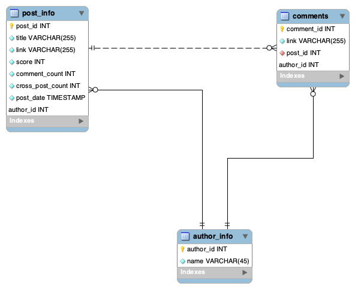
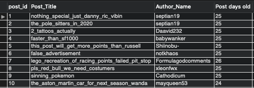

# Assignment-7

## Assignment 7 Learning Objectives
> - Using an online JSON data source, create a database model that will hold the data, and import the JSON data into MySQL.
> - Also create SQL Views & stored procedures, and use them in PostMan(REST) to read queries.

### Part I
> Identify JSON Data Source

- Every reddit includes a JSON version of the postings.
- I Extracted the raw JSON data from a subreddit called **r/formuladank**, and saved the raw data off of chrome to a file
  - see raw data [Here](Code/cit381-assign07-reddit.json)

### Part II
> Create a model to hold the JSON data collected
> - Design a database to store the reddit information.

- After I had analyzed the JSON, and determined what tables will be needed, I created primary keys for each table.
  - One Table to hold post information
  - Another table to hold author information
  - A third table to hold comment information

### Part III
> Manually entering rows of JSON data into MySQL

- This part of the assignment required me to read the JSON file and determine what information I had to pull in order to populate my three tables.
  - See my data in this [file](Code/cit381-assign07-data.csv)

### Part IV
>SQL View

- In this part of the assignment I had created one meaningful view that listed the: post ID, post title, author of the post, and the age of the post in days.

  - for SQL code see [Here](Code/cit381-assign07-view.sql)

### Part V
> SQL stored procedures

- This Section of the assignment required me to create stored procedures that executed two functions:
1. The first stored procedure inserts user IDs and any other user information that can be considered viable for the author table
2. The second stored procedure inserts any data found useful for the posting table

>> code for this section can be found [Here](Code/cit381-assign07-procedures.sql)
